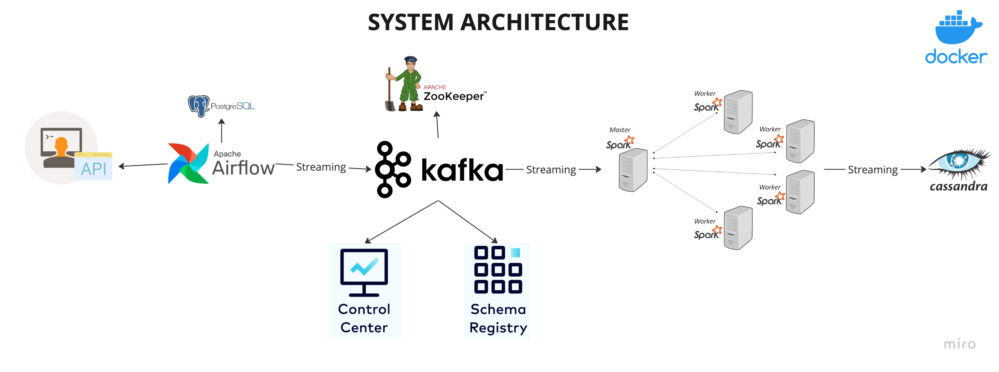
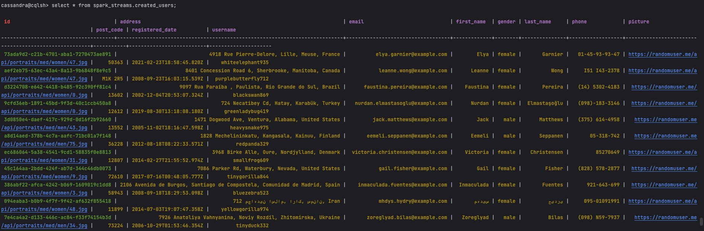

# Project Explanation
This repo is my attempt to recreate a project I found on YouTube ([link here](https://www.youtube.com/watch?v=GqAcTrqKcrY&ab_channel=CodeWithYu)) by "CodeWithYu" that explains how to go through an end-to-end Data Engineering project that put together several essential technologies like Apache Kafka, Apache Airflow, Apache Zookeper, Apache Spark, Cassandra database, and Postgres database all containerized with Docker. Here's the high-level view of the system architecture:

*This image is from "CodeWithYu" video tutorial. It's not mine.*

Let's go through all the steps to recreate this project:
1. fetch some data from https://randomuser.me/, which is a free API that provides random user data with a specific trigger by Apache Airflow;
2. data is then streamed into Apache Kafka, which is sitting on Apache Zookeeper (Zookeeper is a distributed coordination service for distributed systems);
3. data inside the Kafka Broker will be visualized in a Control Center, which serves as UI where we can see what is going on in Kafka Brokers;
4. data that we get from Kafka will be streamed with Apache Spark;
5. data will be stored in Cassandra database.

All (almost actually*) the architecture are running on Docker Containers.

*Actually Spark architecture is not running on Docker Containers. I tried to do it, but I had some problems with it that I was not able to solve after several attempts. So, I decided to run Spark on my local machine in local mode.

Note: Contrarily to the system architecture above, I didn't use Postgres database and Schema Registry.

# Getting Started
1. Clone this repository:
```
git clone https://github.com/simdangelo/food-ordering-app.git
```
2. Create a virtual environment and install the requirements with `requirements.txt` file (this project is proven to work with Python 3.10):
```
pip install -r requirements.txt
```
3. Navivate to the project directory and spin up the Docker containers through `docker-compose.yml` file (install Docker if you don't have it yet):
```
docker-compose up
```
4. Wait for the containers to be up and running. Then open the terminal in your IDE and run:
```
spark-submit --master local --packages com.datastax.spark:spark-cassandra-connector_2.12:3.5.0,org.apache.spark:spark-sql-kafka-0-10_2.12:3.5.0  spark_stream.py
```
7. Then open Airflow UI at `http://localhost:8080/` (the specific port depends of course on how you set `docker-compose.yml`) and trigger the `user_automation` DAG so that data starts to be fetched from the API and streamed into Cassandra DB.
8. After waiting for 2 minute (in the code I set data to be fetched for only 2 minutes), you can start Cassandra CQLSH with:
```
docker exec -it cassandra cqlsh -u cassandra -p cassandra localhost 9042
```
and check if the data is correctly stored in the `created_users` table:
```
select * from spark_streams.created_users;
```

# Results
If all the steps above were successful, you should see the data being stored in the Cassandra database like this:


# Open Issues
I wanted to run Spark on Docker Containers, but I was not able to do that. My suspicion is that there are some compatibility issues between the versions of the technologies I used. If someone is able to solve this issue, please let me know. I would be very grateful.

# What I Learned
Even though I just recreated a project that was already done by someone else, I took the opportunity to learn new technologies and how to put them together.
* I used Apache Kafka for the first time. I learned how to create a topic, how to produce and consume data from it.
* I used Apache Airflow for the first time. I learned how to create a DAG, how to trigger it, and how to visualize the data that is being fetched from the API.
* I used Apache Cassandra for the first time. I learned how to create a keyspace, how to create a table, and how to insert data into it.
* I just used Apache Spark (in batch mode actually) many times before, but I learned how to use it in streaming mode.

# What's Next
I want to know something more about Apache Airflow and especially Apache Kafka that, as far as I know, are very powerful and utilized tools. With regard to Kafka, Confluent site and its YouTube channel seems to be a good place to start with because, besides writing code, I need to know much more about the theoretical aspects of it (what is a topic, what is a broker, what is a consumer, when to use Kafka, how to configure it for a mature environment, etc).

